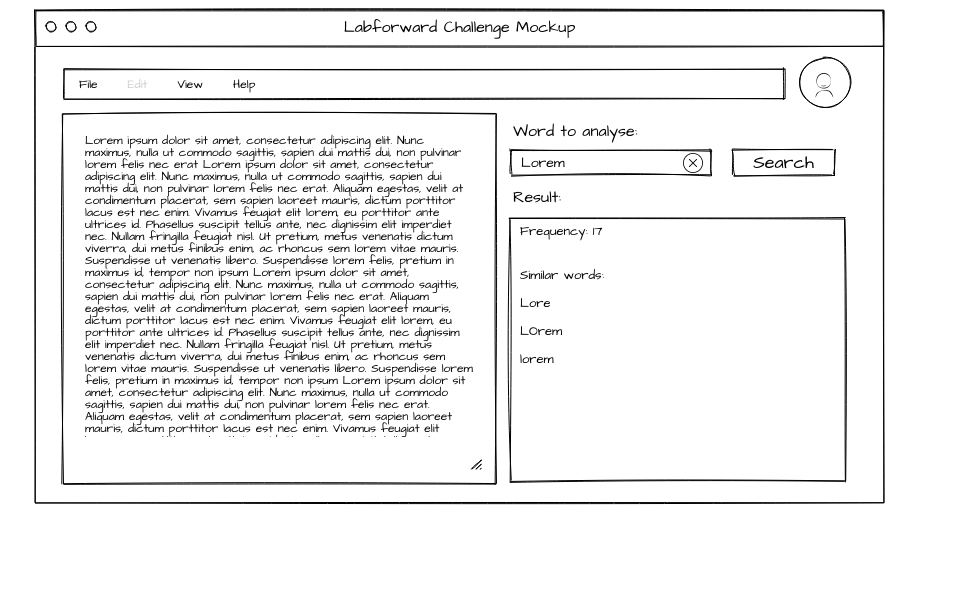

# labforward-challenge

## Challenge

The full challenge took from 4 to 5 hours from building app from the scratch.

## Possible approaches

Most likely the text should not be passed as the request parameter, it could be a document (e.g, stored in a different
format)
in a database/filesystem. Moreover, a customer could ask for analyzing not only one notebook entry but a bunch of
scientific books, articles, etc. So, it's possible to prebuild the word statistic in memory, database, e.g. in an
index (e.g. Lucene-based approach) which will be initialized on the application startup. The area to research is how to
design the process when one of the files will be modified/deleted, or a new file will be added. The
reindexing operation should be done after the CRUD file operation.

All the security-related stuff should be implemented too.

## Technologies

The application is written using Spring Framework.

* Spring Boot project allows getting the application up and running as quickly as possible.
* Apache Commons Text for Levenshtein distance implemented function.
* Apache Commons Text has a commons-lang3 as a compile dependency, but also MutableInt class is used from this library,
  so it is explicitly declared.
* Spring Boot Validation for the bean validation.
* SpringDoc OpenAPI for the documented API.

## Info Endpoints

[Service OpenAPI description](http://localhost:8080/api/v3/api-docs/)

[Swagger UI HTML page](http://localhost:8080/api/swagger-ui.html)


## Analytics Endpoint

Curl query example:
```bash
curl -X 'GET' \
  'http://localhost:8080/api/text/analysis?word=Word&text=Word%20Wor%20WrD' \
  -H 'accept: application/json;charset=UTF-8'
```

## Application properties

|Name   |  Default value | Description  |
|---|---|---|
|server.servlet.context-path| /api  | The context path of the app  |
|spring.main.banner-mode| off  | Disables Spring Boot banner  |
|text.analyzer.required.distance   | 1  | The required Levenshtein distance  |

## Requirements

* JDK 16
* Maven 3.6.3

## Build command

`mvn clean package`

## Application startup

`mvn spring-boot:run`

## Links

[Releases](https://github.com/rplatonov/labforward-challenge/releases) for a detailed version history.

## User Interface markup



The proposed POC of the user interface is quite simple,
there is a form with the following elements:
* top panel, where the user avatar is placed (and by click on it the dropdown menu will be opened to go to the user's settings).
* file editor buttons, it's more applicable for the case when a file is stored somewhere.
* text area as editor, where is possible to make changes in a text.
* word input field with a search button. The analysis will be done after clicking this button, and the button will be disabled until the response will be fetched (to avoid multi-clicking). It will also have a clear icon to remove the last search result from UI.
* result showing area (will be displayed only if the search was done).
